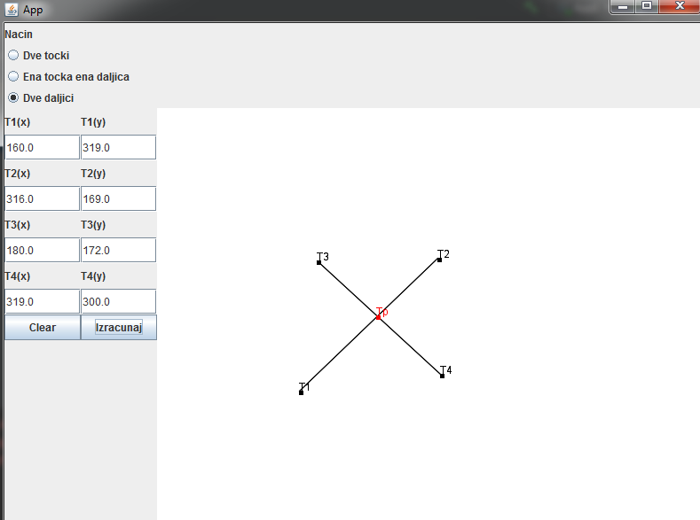

# Uvod u racunarsku geometriju
Program koji omogucava uporabniku: 
* Unos dvije tacke
* Unos jedne tacke i jedne duzi
* Unos dvije duzi
* Racunanje udaljenosti dvije tacke
* Racunanje ortogonalne projekcije tacke na duz
* Racunanje tacke presecista dvije duzi

## Izgled aplikacije

